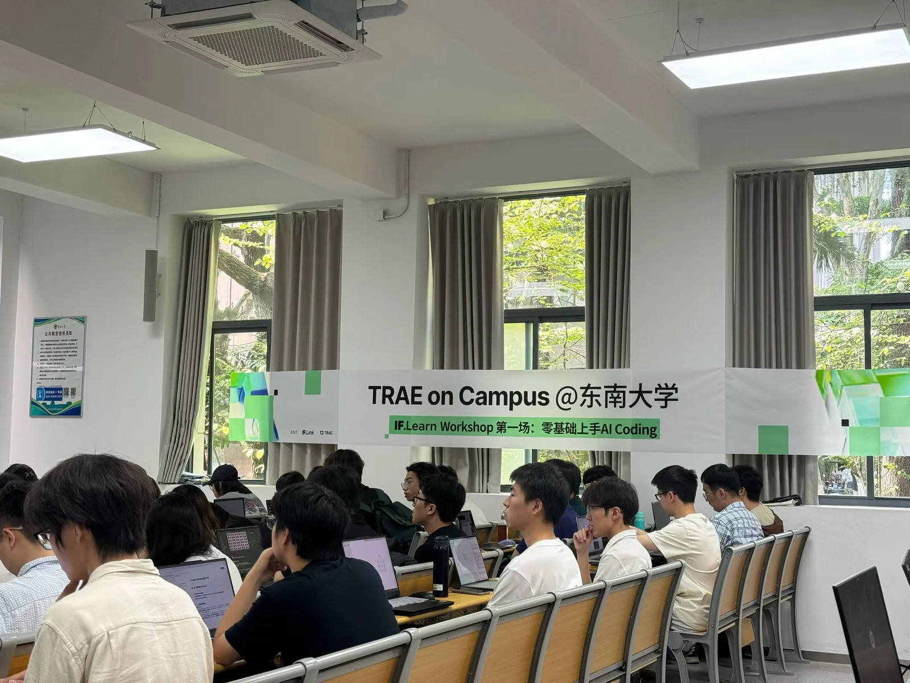

2026 年 5 月，计算机协会成员前往东南大学，参加 TRAE on Campus 系列活动中的“IF.Learn Workshop 第一场：零基础上手 AI Coding”。同学们围绕 AI 辅助编程展开学习，与东南大学学生交流使用工具和开展实践的经验。

工作坊以“创意到落地，手把手教你构建 AI 应用”为主题，活动安排涵盖基础讲解与 TRAE 安装教学、网页 Demo 开发、线上部署教学和实践，以及作品展示与合照交流。内容从工具入门逐步延伸到应用开发，为初次接触 AI Coding 的参与者提供了实践路径。

活动现场，同学们携带笔记本电脑参加学习，在讲解和交流中接触 AI 辅助开发的使用方式。网页开发与部署环节将学习目标落到具体应用上，也为参与者进一步探索 AI 编程工具提供了切入点。

此次工作坊是协会在校外开展技术交流的一次实践。与其他高校同学一起学习和讨论，让成员有机会接触不同的开发经验，也为协会今后的软件实践与技术分享积累了素材。
