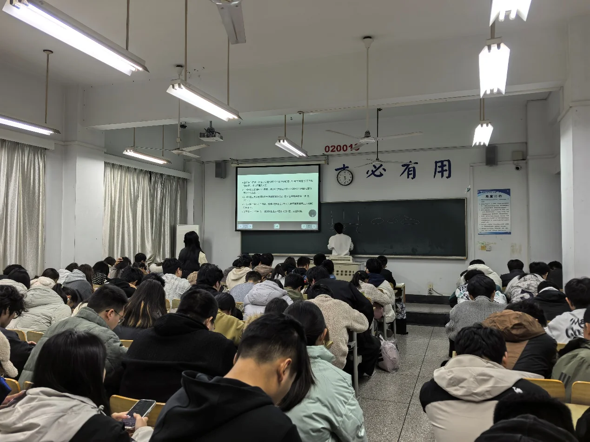

2025 年 11 月 23 日 18:00 至 20:00，计算机协会在文昌 402 举办“算法试金石：从递归递推到动态规划”专题讲座。活动面向电子与计算机工程学院各年级同学，通过理论讲解、例题分析和互动答疑，帮助大家梳理算法学习中的难点。

讲座由王文腾主讲，围绕动态规划的基本概念、核心思想、适用场景和解题步骤展开。主讲人以斐波那契数列、背包问题等实例为切入点，将抽象的算法思路放到具体问题中讨论，并结合不同解法分析时间与空间开销。

在例题讲解环节，主讲人选取不同难度的题目，逐步分析题目特点、解题思路、状态设计与代码实现。讲解从基础问题延伸到综合应用，帮助同学们理解如何把问题转化为可以编程求解的状态与关系。

现场还安排了代码演示和提问交流。同学们可以围绕例题与解题过程中的疑问展开讨论，将听讲中遇到的问题及时提出。结合具体代码进行解释，也让算法思路与程序实现之间的联系更加清楚。

本次讲座与协会日常算法练习相衔接，为同学们继续参加程序设计竞赛、巩固课程知识提供了专题学习机会。
