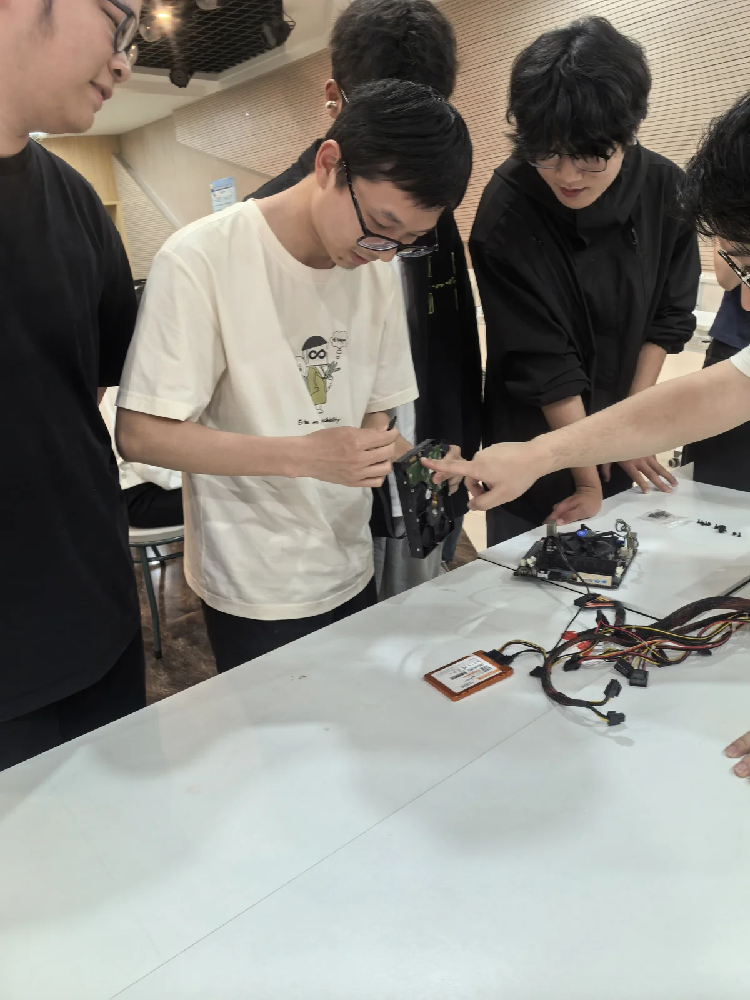

2025 年 5 月 8 日，计算机协会开展计算机硬件基础分享暨组装比赛。活动采用“先讲座、后比赛”的形式，将硬件基础知识与实际操作结合起来，让同学们通过接触和组装真实部件，认识计算机的内部结构。

前期，协会围绕活动方案、器材准备和组织安排开展筹备。知识分享环节介绍计算机硬件基础及相关发展情况，为后续组装实践作铺垫。日常使用电脑时不容易看到的内部部件，由此成为同学们可以观察、辨认和操作的学习材料。

在实践环节，同学们围绕摆放在桌面的主板、存储设备和供电部件进行组装。有人动手操作，有人在一旁观察连接方式、交流安装思路，将讲解中的内容与具体部件对应起来。硬件之间如何连接、各部分如何配合，需要在实际操作中逐步理解。

本次活动将协会的实践内容延伸到计算机硬件，为同学们提供了学习软件编程之外的另一种技术体验。通过知识分享与动手操作相结合，大家有机会把对计算机的认识落实到具体器件，积累硬件组装与协作实践经验。
