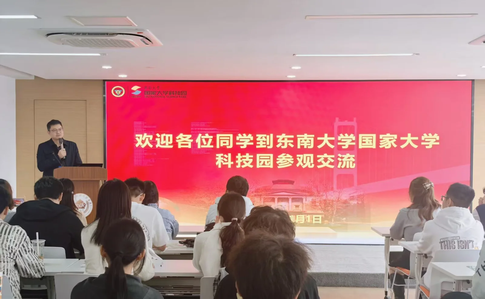

2025 年 11 月 1 日，计算机协会与创协联合组织东南大学国家大学科技园参观交流活动。协会成员走出校园，围绕科技创新、大学生创业和项目实践，与园区老师及参与交流的同学进行学习讨论。

活动中，科技园负责人介绍了科技创新趋势、创业政策支持，以及园区面向大学生创业项目提供的孵化流程与资源。通过讲解，同学们进一步了解了一个项目从初步构想到寻求支持、逐步落地所涉及的实际环节。

项目交流环节，同学们介绍了正在开展或构思中的项目，分享项目背景、主要内容和技术特点。参与创业的同学结合项目研发、孵化与市场推广经历，交流推进过程中遇到的困难；投资机构代表则介绍了评估创业项目时关注的因素，为大家提供了不同于课堂学习的观察角度。

此次活动还安排了园区参观。专题分享、项目交流与实地走访相结合，让同学们有机会了解计算机技术在创新创业中的应用，也为今后参与项目实践、思考技术成果如何落地提供了参考。
